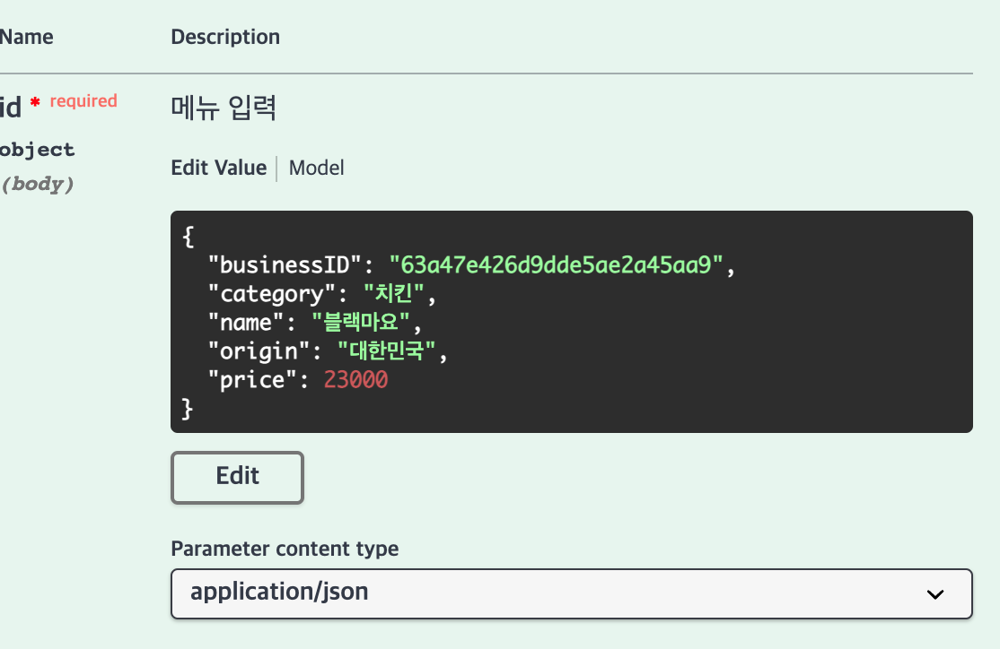

# WBA BE Project - 23

# 기술 스택

go version : go1.19.4 darwin/arm64

# 실행 방법

```bash
git clone https://github.com/codestates/WBABEProject-23.git
cd WBABEProject-23
go mod tidy
```

설정파일은 빠져있으므로 config 폴더에 config.toml 파일을 만들고 다음 내용을 넣는다.

```bash
[server] ##nomal type
mode = "dev"
host = "localhost:8080"

[db] #data access object
[db.admin]
host = "mongodb://127.0.0.1:27017"
user = #user name
pass = #password

[log]
level = "debug"
fpath = "./logs/go-loger"
msize = 2000
mage = 7
mbackup = 5
```

이후 실행한다

```bash
go run main.go
```

# **기능**

### 메뉴 신규 등록  - 피주문자

- **API | POST /menu**
    - 사업장에서 신규 메뉴 관련 정보를 등록하는 과정(ex. 메뉴 이름, 주문가능여부, 한정수량,  원산지, 가격, 맵기정도, etc)
    - 성공 여부를 리턴
    - input form
        
        ```json
        {
          "businessID": "string",
          "category": "string",
          "name": "string",
          "origin": "string",
          "price": 0
        }
        ```
        
        - 실행결과
            
            인풋
            
            
            
            결과
            
            
            
            ```json
            {
                "_id" : ObjectId("63b811f0630198e33de2e772"),
                "name" : "블랙마요",
                "state" : NumberInt(1),
                "price" : NumberInt(23000),
                "origin" : "치킨",
                "score" : 0.0,
                "is_deleted" : false,
                "category" : "치킨",
                "business_id" : DBRef("business", ObjectId("63a47e426d9dde5ae2a45aa9"))
            }
            ```
            

### 메뉴 수정 / 삭제 - 피주문자

- **API | PATCH /menu**
    - 사업장에서 기존의 메뉴 정보 변경기능(ex. 가격변경, 원산지 변경, soldout)
    - 메뉴 삭제시, 실제 데이터 백업이나 뷰플래그를 이용한 안보임 처리
    - 금일 추천 메뉴 설정 변경, 리스트 출력
    - 성공 여부를 리턴
    - input form
        
        ```json
        {
          "category": "string",
          "id": "string",
          "isDeleted": true,
          "name": "string",
          "origin": "string",
          "price": 0,
          "state": 2
        }
        ```
        
        - 실행결과
            
            인풋
            
            
            
            실행결과
            
            
            
            ```json
            {
                "_id" : ObjectId("63b811f0630198e33de2e772"),
                "name" : "블랙마요",
                "state" : NumberInt(1),
                "price" : NumberInt(23000),
                "origin" : "치킨",
                "score" : 0.0,
                "is_deleted" : false,
                "category" : "치킨",
                "business_id" : DBRef("business", ObjectId("63a47e426d9dde5ae2a45aa9"))
            }
            ```
            

### 메뉴 리스트 출력 조회 - 주문자

- **API | GET /menu**
    - 각 카테고리별  sort 리스트 출력(ex. order by 추천, 평점, 재주문수, 최신)
    - 결과 5~10여개 임의 생성 출력, sorting 여부 확인
    - input form
        
        ```
        name :  query : 가게 id
        sort :  query : sort할 컬럼 이름
        order:  query : 1은 오름차순 그 외 내림자순
        ```
        
        - 실행결과
            
            인풋
            
            
            
            결과
            
            ```json
            {
              "code": 200,
              "data": [
                {
                  "_id": "63b24924e9ca15589a6ef311",
                  "category": "치킨",
                  "name": "핫윙",
                  "origin": "대한민국",
                  "price": 10000,
                  "score": 0
                },
                {
                  "_id": "63b248e3e9ca15589a6ef30e",
                  "category": "치킨",
                  "name": "허니콤보",
                  "origin": "대한민국",
                  "price": 19000,
                  "score": 5
                },
                {
                  "_id": "63b248fce9ca15589a6ef30f",
                  "category": "치킨",
                  "name": "레드콤보",
                  "origin": "대한민국",
                  "price": 19000,
                  "score": 0
                },
                {
                  "_id": "63b24941e9ca15589a6ef313",
                  "category": "치킨",
                  "name": "고추바사사삭",
                  "origin": "미국",
                  "price": 20000,
                  "score": 0
                },
                {
                  "_id": "63b24907e9ca15589a6ef310",
                  "category": "치킨",
                  "name": "레헌반반",
                  "origin": "대한민국",
                  "price": 21000,
                  "score": 0
                },
                {
                  "_id": "63b811f0630198e33de2e772",
                  "category": "치킨",
                  "name": "블랙마요",
                  "origin": "치킨",
                  "price": 23000,
                  "score": 0
                }
              ],
              "message": "ok"
            }
            ```
            

### 메뉴별 평점 및 리뷰 조회 - 주문자

- **API | GET /review**
    - UI에서 메뉴 리스트에서 상기 리스트 출력에 따라 개별 메뉴를 선택했다고 가정
    - 해당 메뉴 선택시 메뉴에 따른 평점 및 리뷰 데이터 리턴
    - input form
        
        ```
        id   : query : 메뉴 id
        ```
        
        - 실행결과: 리뷰 있을 때
            
            인풋
            
            
            
            결과
            
            ```json
            {
              "code": 200,
              "data": [
                {
                  "_id": "63b671dea9416fb2dbae006c",
                  "content": "맛있어요",
                  "menu_id": "63b248e3e9ca15589a6ef30e",
                  "menu_name": {
                    "_id": "63b248e3e9ca15589a6ef30e",
                    "business_id": {
                      "$id": "63a47e426d9dde5ae2a45aa9",
                      "$ref": "business"
                    },
                    "category": "치킨",
                    "is_deleted": false,
                    "name": "허니콤보",
                    "origin": "대한민국",
                    "price": 19000,
                    "score": 5,
                    "state": 1
                  },
                  "order_id": "63b4e9b407b38d1dad1559cf",
                  "orderer": "장민혁",
                  "score": 5
                }
              ],
              "message": "ok"
            }
            ```
            

### 메뉴별 평점 작성 - 주문자

- **API | POST /review**
    - 해당 주문내역을 기준, 평점 정보, 리뷰 스트링을 입력받아 과거 주문내역 업데이트 저장
    - 성공 여부 리턴
    - input form
        
        ```json
        {
          "content": "string",
          "menu_id": "string",
          "order_id": "string",
          "orderer": "string",
          "score": 0
        }
        ```
        
        - 실행결과
            
            인풋
            
            
            
            결과
            
            
            
            db
            
            주문 콜렉션
            
            
            
            리뷰 콜렉션
            
            ```json
            {
                "_id" : ObjectId("63b817fc9686e7d19b1925b3"),
                "order_id" : ObjectId("63b4e9b407b38d1dad1559cf"),
                "menu_id" : ObjectId("63b248fce9ca15589a6ef30f"),
                "orderer" : "장민혁",
                "content" : "맛있을지도?",
                "score" : 3.0
            }
            ```
            
            메뉴 콜렉션 : 평점 추가로 평점 생김
            
            ```json
            {
                "_id" : ObjectId("63b248fce9ca15589a6ef30f"),
                "name" : "레드콤보",
                "state" : NumberInt(1),
                "price" : NumberInt(19000),
                "origin" : "대한민국",
                "score" : 3.0,
                "is_deleted" : false,
                "category" : "치킨",
                "business_id" : DBRef("business", ObjectId("63a47e426d9dde5ae2a45aa9"))
            }
            ```
            

### 주문 - 주문자

- **API | POST /order**
    - 주문정보를 입력받아 주문 저장(ex. 선택 메뉴 정보, 전화번호, 주소등 정보를 입력받아 DB 저장)
    - 주문 내역 초기상태 저장
    - 금일 주문 받은 일련번호-주문번호 리턴
    - input form : 주문자 이름, 주문 가게 이름, 메뉴 배열형태만 입력
        
        ```json
        {
          "bid": "string",
          "menu": [
            {
              "menuID": "string",
              "number": 0
            }
          ],
          "orderer": "string"
        }
        ```
        
        - 실행결과
            
            인풋
            
            
            
            결과
            
            
            
            ```json
            {
                "_id" : ObjectId("63b819bd5b02c0ee57124bed"),
                "orderid" : NumberLong(1),
                "business_id" : ObjectId("63a47e426d9dde5ae2a45aa9"),
                "orderer" : "장민혁",
                "state" : NumberInt(1),
                "menu" : [
                    {
                        "menu_id" : ObjectId("63b811f0630198e33de2e772"),
                        "number" : NumberInt(2),
                        "is_reviewed" : false
                    }
                ],
                "created_at" : ISODate("2023-01-06T12:53:17.109+0000"),
                "updated_at" : ISODate("2023-01-06T12:53:17.109+0000")
            }
            ```
            

### 주문 변경 - 주문자

- **API | PATCH /order**
    - 메뉴 추가시 상태조회 후 `배달중`일 경우 실패 알림
        - 성공 실패 알림, ~~실패시 신규주문으로 전환~~
    - 메뉴 변경시 상태가 `조리중`, `배달중`일 경우 확인
        - 성공 실패 알림
    - input form : 수정할 주문 번호, 변경한 주문 메뉴 [{메뉴이름, 수량}]
        
        ```json
        {
          "menu": [
            {
              "menuID": "string",
              "number": 1
            }
          ],
          "orderID": "string"
        }
        ```
        
        - 실행결과
            
            변경할 주문
            
            ```json
            {
                "_id" : ObjectId("63b819bd5b02c0ee57124bed"),
                "orderid" : NumberLong(1),
                "business_id" : ObjectId("63a47e426d9dde5ae2a45aa9"),
                "orderer" : "장민혁",
                "state" : NumberInt(1),
                "menu" : [
                    {
                        "menu_id" : ObjectId("63b811f0630198e33de2e772"),
                        "number" : NumberInt(2),
                        "is_reviewed" : false
                    }
                ],
                "created_at" : ISODate("2023-01-06T12:53:17.109+0000"),
                "updated_at" : ISODate("2023-01-06T12:53:17.109+0000")
            }
            ```
            
            인풋
            
            ```json
            {
              "menu": [
                {
                  "menuID": "63b811f0630198e33de2e772",
                  "number": 1
                },
                {
                  "menuID": "63b24941e9ca15589a6ef313",
                  "number": 1
                }
              ],
              "orderID": "63b819bd5b02c0ee57124bed"
            }
            //기존 메뉴 수량 2개에서 1개로 바꾸고 다른 메뉴 한 개 추가
            ```
            
            결과
            
            
            
            db결과
            
            ```json
            {
                "_id" : ObjectId("63b819bd5b02c0ee57124bed"),
                "orderid" : NumberLong(1),
                "business_id" : ObjectId("63a47e426d9dde5ae2a45aa9"),
                "orderer" : "장민혁",
                "state" : NumberInt(4),
                "menu" : [
                    {
                        "menu_id" : ObjectId("63b811f0630198e33de2e772"),
                        "number" : NumberInt(1),
                        "is_reviewed" : false
                    },
                    {
                        "menu_id" : ObjectId("63b24941e9ca15589a6ef313"),
                        "number" : NumberInt(1),
                        "is_reviewed" : false
                    }
                ],
                "created_at" : ISODate("2023-01-06T12:53:17.109+0000"),
                "updated_at" : ISODate("2023-01-06T12:57:46.553+0000")
            }
            ```
            

### 주문 내역 조회 - 주문자

- **API | GET /order**
    - 현재 주문내역 리스트 및 상태 조회 - 하기 **주문 상태 조회**에서도 사용
        - ex. 접수중/조리중/배달중 etc
        - 없으면 null 리턴
    - 과거 주문내역 리스트 최신순으로 출력
        - 없으면 null 리턴
    - 과거 주문 : 배달 완료된 주문, 현재 주문: 그 외
    - input form
        
        ```
        name : query : 유저이름
        cur : query : 1은 현재, 그외 과거
        ```
        
        - 실행결과: 현재 주문
            
            인풋
            
            
            
            결과
            
            ```json
            {
              "code": 200,
              "data": [
                {
                  "ID": "63b6813984fcb6498c77a8d0",
                  "OrderID": 0,
                  "BID": "000000000000000000000000",
                  "Orderer": "장민혁",
                  "State": 4,
                  "Menu": [
                    {
                      "MenuID": "63b248fce9ca15589a6ef30f",
                      "Number": 2,
                      "IsReviewed": false
                    }
                  ],
                  "CreatedAt": "0001-01-01T00:00:00Z",
                  "UpdatedAt": "0001-01-01T00:00:00Z"
                },
                {
                  "ID": "63b819bd5b02c0ee57124bed",
                  "OrderID": 0,
                  "BID": "000000000000000000000000",
                  "Orderer": "장민혁",
                  "State": 4,
                  "Menu": [
                    {
                      "MenuID": "63b811f0630198e33de2e772",
                      "Number": 1,
                      "IsReviewed": false
                    },
                    {
                      "MenuID": "63b24941e9ca15589a6ef313",
                      "Number": 1,
                      "IsReviewed": false
                    }
                  ],
                  "CreatedAt": "0001-01-01T00:00:00Z",
                  "UpdatedAt": "0001-01-01T00:00:00Z"
                }
              ],
              "message": "ok"
            }
            
            //몇몇 정보는 필터링 하였음
            ```
            
        - 실행결과: 과거 주문
            
            인풋
            
            
            
            결과
            
            ```json
            {
              "code": 200,
              "data": [
                {
                  "ID": "63b4e9b407b38d1dad1559cf",
                  "OrderID": 0,
                  "BID": "000000000000000000000000",
                  "Orderer": "장민혁",
                  "State": 10,
                  "Menu": [
                    {
                      "MenuID": "63b248e3e9ca15589a6ef30e",
                      "Number": 1,
                      "IsReviewed": true
                    },
                    {
                      "MenuID": "63b248fce9ca15589a6ef30f",
                      "Number": 1,
                      "IsReviewed": true
                    }
                  ],
                  "CreatedAt": "0001-01-01T00:00:00Z",
                  "UpdatedAt": "0001-01-01T00:00:00Z"
                }
              ],
              "message": "ok"
            }
            ```
            

### 주문 상태 조회 - 피주문자

- **API | GET /order/admin**
    - input form
        
        ```
        businessname : query : 사업체이름
        ```
        
        - 실행결과
            
            인풋
            
            
            
            결과
            
            ```json
            {
              "code": 200,
              "data": [
                {
                  "ID": "63b4e9b407b38d1dad1559cf",
                  "OrderID": 1,
                  "BID": "63a47e426d9dde5ae2a45aa9",
                  "Orderer": "장민혁",
                  "State": 10,
                  "Menu": [
                    {
                      "MenuID": "63b248e3e9ca15589a6ef30e",
                      "Number": 1,
                      "IsReviewed": true
                    },
                    {
                      "MenuID": "63b248fce9ca15589a6ef30f",
                      "Number": 1,
                      "IsReviewed": true
                    }
                  ],
                  "CreatedAt": "2023-01-04T02:51:32.551Z",
                  "UpdatedAt": "0001-01-01T00:00:00Z"
                },
                {
                  "ID": "63b6813984fcb6498c77a8d0",
                  "OrderID": 1,
                  "BID": "63a47e426d9dde5ae2a45aa9",
                  "Orderer": "장민혁",
                  "State": 4,
                  "Menu": [
                    {
                      "MenuID": "63b248fce9ca15589a6ef30f",
                      "Number": 2,
                      "IsReviewed": false
                    }
                  ],
                  "CreatedAt": "2023-01-05T07:50:17.648Z",
                  "UpdatedAt": "0001-01-01T00:00:00Z"
                },
                {
                  "ID": "63b819bd5b02c0ee57124bed",
                  "OrderID": 1,
                  "BID": "63a47e426d9dde5ae2a45aa9",
                  "Orderer": "장민혁",
                  "State": 4,
                  "Menu": [
                    {
                      "MenuID": "63b811f0630198e33de2e772",
                      "Number": 1,
                      "IsReviewed": false
                    },
                    {
                      "MenuID": "63b24941e9ca15589a6ef313",
                      "Number": 1,
                      "IsReviewed": false
                    }
                  ],
                  "CreatedAt": "2023-01-06T12:53:17.109Z",
                  "UpdatedAt": "2023-01-06T12:57:46.553Z"
                }
              ],
              "message": "ok"
            }
            ```
            
- **API | PATCH /order/admin**
    - ~~메뉴별로 상태 저장~~  → 주문 별로 저장
    - ex. 상태 : 접수중/접수취소/추가접수/접수-조리중/배달중/배달완료 등을 이용 상태 저장
    - 각 단계별 사업장에서 상태 업데이트
        - **접수중 → 접수** or **접수취소 → 조리중** or **추가주문 → 배달중**
        - 성공여부 리턴
    - input form
        
        ```json
        {
          "orderId": "string",
          "state": 0
        }
        ```
        
        - 실행결과
            
            인풋
            
            
            
            결과
            
            
            
            ```json
            {
                "_id" : ObjectId("63b819bd5b02c0ee57124bed"),
                "orderid" : NumberLong(1),
                "business_id" : ObjectId("63a47e426d9dde5ae2a45aa9"),
                "orderer" : "장민혁",
                "state" : NumberInt(10),
                "menu" : [
                    {
                        "menu_id" : ObjectId("63b811f0630198e33de2e772"),
                        "number" : NumberInt(1),
                        "is_reviewed" : false
                    },
                    {
                        "menu_id" : ObjectId("63b24941e9ca15589a6ef313"),
                        "number" : NumberInt(1),
                        "is_reviewed" : false
                    }
                ],
                "created_at" : ISODate("2023-01-06T12:53:17.109+0000"),
                "updated_at" : ISODate("2023-01-06T12:57:46.553+0000")
            }
            ```
            
- Swagger 참조 (피드백 반영하여 uri 수정)
    
    
    

# DB


위와 같이 5개의 컬렉션을 만들었다.

### business

사업체 정보를 저장하는 컬렉션. 이번 구현한 api에서 write하지 않기 때문에 직접 데이터를 만들어 넣어준다.

메뉴를 렉션으로 분리하면서 가게 이름과 관리자 정보만 저장하도록 변경 되었다. 이번 구현에서는 사실상 쓰이지 않는다.

ex)


### menu

메뉴 정보를 저장하는 컬렉션. 사업체를 참조하고 있고, 삭제 여부를 is_deleted라는 플래그로 관리한다.

그 외에 name, state, price, origin, score, category같은 정보들을 저장한다.

score는 직접 변경 할 수 없고 리뷰 작성시 계산되어 자동으로 들어간다.

ex)


### order

주문 정보를 저장하는 컬렉션 api를 통해 추가하고 상태를 변경할 수 있다.

필드로 orderid, orderer, business_id, menu, created_at, updated_at, state를 갖고 각각 

주문번호, 주문자 이름, 사업체 id, {주문메뉴, 수량, 리뷰}의 배열, 주문 시간, 주문 업데이트 시간, 상태를 나타낸다.

주문번호는, 그 날에 몇 번째로 주문했는지를 나타낸다. 다만 mongodb에서 Date가 UTC로만 저장 돼서 UTC기준으로 카운팅 되게 된다.

ex)


메뉴는 자세히 보면 다음과 같이 생겼다.


### review

주문 메뉴에대한 리뷰를 저장하는 컬렉션

필드로 orderid, menu_id, orderer, menuname, content, score가 있고 각각 작성한 리뷰가 들어간 order의 id, 메뉴의 id, 주문자, 메뉴이름, 리뷰 내용, 평점이다.


## TODO

1. 컨트롤러, 모델 도메인별로 분리
2. 반복해서 쓰이는 기능 함수화하고 모듈화해서 정리
3. 함수 분리해서 직접 진행한 인풋 데이터 유효성 검사 gin validator로 바꾸기
4. 응답 데이터에 보내지 않아야하는 정보 필터링해서 정리
5. 서비스 계층 만들기
6. 컨벤션 맞추기

처음부터 다시 짜는게 더 빠르겠다…